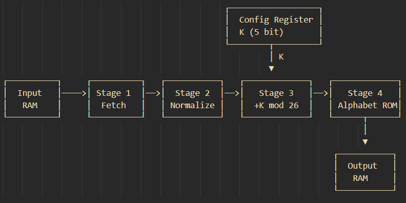

# ZCH 25/26 - špecifikácia projektu
# Prúdové spracovanie dát a ich šifrovanie Caesarovou šifrou
## Timotej Halenár - xhalen00

## 1. Popis aplikácie
Aplikácia spracováva textové dáta z pamäti a šifruje ich Caesarovou šifrou. Aplikácia predpokladá na vstupe malé znaky latinskej abecedy a-z reprezentované ako ASCII znaky. Caesarova šifra posunie každý znak na vstupe o konštantu K, ktorá je uložená v konfigurovateľnom registri.

## 2. Bloková schéma

## 3. Popis rozhrania
| Signál    | Smer | Šírka  | Popis                                         |
|-----------|------|--------|-----------------------------------------------|
| `clk`     | IN   | 1 bit  | Hodinový signál                               |
| `rst`     | IN   | 1 bit  | Synchrónny reset                              |
| `start`   | IN   | 1 bit  | Spustenie spracovania                         |
| `cfg_we`  | IN   | 1 bit  | Write enable pre konfiguračný register        |
| `cfg_key` | IN   | 5 bit  | Kľúč K (hodnoty 0–25)                         |
| `done`    | OUT  | 1 bit  | Signalizácia dokončenia spracovania           |

## 4. Popis blokov
 
### Key Register
- 5 bit
- Uchováva kľúč K
- Zápis riadený signálom `cfg_we`
- Po resete: `K = 0`
- K musí byť nastavené pred signálom `start`
 
### Input RAM
- 256 × 8 bit
- Inicializovaná vstupnými dátami
 
### Stage 1 – Fetch
- Číta bajt z input RAM podľa aktuálnej adresy
- Inkrementuje adresový čítač
- Ukladá byte a adresu na výstup
 
### Stage 2 – Normalize
- Vypočíta index v abecede ako `index = byte - 0x61`
- Výstup: 5-bitový index (0–25)
 
### Stage 3 – Offset
- Vypočíta `(index + K) mod 26`
- Výstup: 5-bitová adresa do Alphabet ROM
 
### Alphabet ROM
- Veľkosť: 26 × 8 bit
- Obsah: `['a', 'b', ..., 'z']`
 
### Stage 4 – Writeback
- Číta výsledný byte z Alphabet ROM
- Zapisuje ho do output RAM na zodpovedajúcu výstupnú adresu
- Po spracovaní posledného bajtu nastaví signál `done`
 
### Output RAM
- Veľkosť: 256 × 8 bit

## 5. Testovacie scenáre

### 5.1 Základné šifrovanie

**Čo testuje:** Správnosť výpočtu pre nenulový kľúč, vrátane modulo

**Vstupné dáta:** 
Input RAM: `wxy = [0x77, 0x78, 0x79]`
Kľúč K: 3

**Očakávaný výstup:**
Output RAM: `zab = [0x7A, 0x61, 0x62]`

### 5.2 Zmena kľúča

**Čo testuje:** Zmena kľúča a následný výpočet

**Vstupné dáta:** 
Input RAM: `wxy = [0x77, 0x78, 0x79]`
Kľúč K: 3

**Očakávaný výstup:**
Output RAM: `zab = [0x7A, 0x61, 0x62]`

Po zmene kľúča `K <= 4`  a spustení nového behu:
Output RAM: `abc = [0x61, 0x62, 0x63]`
